# Assembly Guide (WIP)
This doc should go over the basics of how to assemble the 8pack keypad. 

#### Prerequisites
* Basic soldering knowledge and experience (through-hole components, orientation)
* Basic electronics knowledge 

#### Terms used frequently in this guide
* __PCB/Board__ - A printed circuit board. It contains copper tracks in which multiple electronic components are connected together after soldering.
* __Through-hole__ - part of an exposed copper track where electronic components are attached and soldered.
* __Leads__ - long metal wires attached to electronic components. Usually found on simple components like resistors, keyswitches and LEDs
* __Headers__ - A type of connector used to connect components together. Male headers have exposed leads, and female headers have sockets
* __Pins__ - Connections to a microcontroller's ports, usually attached to other electronic components in order to interact with them.
* __Joint__ - the place where a component's lead intersects with a through-hole.

#### Parts in the kit:
* __Keyswitch/button__ - What the microcontroller checks to send keypresses
* __Keycap__ - What your fingers press to interact with your keypad
* __Plate__ - Where the keyswitches are mounted; also protects the electronic components from direct contact.
* __Resistor__ - Component used to protect the LEDs from burning out
* __LED__ - The lighting on the keypad 
* __Header__ - A connector used for attaching electrical components together
* __PCB__ - The board responsible for electrically connecting the keypad together
* __Microcontroller__ - The module responsible for reading the switches and flashing the LEDs. 
* __Standoffs__ - A really long nut with threads on the inside, used to fix/mount boards in place. Usually used with the appropriately-sized screw.

## Board assembly
This section delves into the assembly of the 8pack keypad, in chronological order. Order of assembly is important, as backtracking the steps requires knowledge of desoldering (a difficult process even for experienced hobbyists). There are also sub-steps in the main steps outlined above, which also need to be followed in that order.

DISCLAIMER: The photos used for this guide both show pictures from Ver 1.2 and Ver 1.4. However, the assembly guide focuses on Ver 1.4 and above

# Step 1 - Inspect the parts

Make sure all parts listed above are present.

* Main keypad components
  * 8 x keyswitches
  * 2 x headers
  * 1 x Pro Micro microcontroller board
  * 1 x right-angle pushbutton
  * 1 x top plate
  * 1 x bottom plate
  * 1 x keypad PCB
  * 4 x M3 10mm standoffs
  * 8 x M3 6mm machine screws

* Backlighting components
  * 8 x 1.8mm LEDs
  * 8 x 180 ohm resistors

* Underglow components
  * 2 x LED WS2812B strips
  * 3 x wires (one colour of each wire)

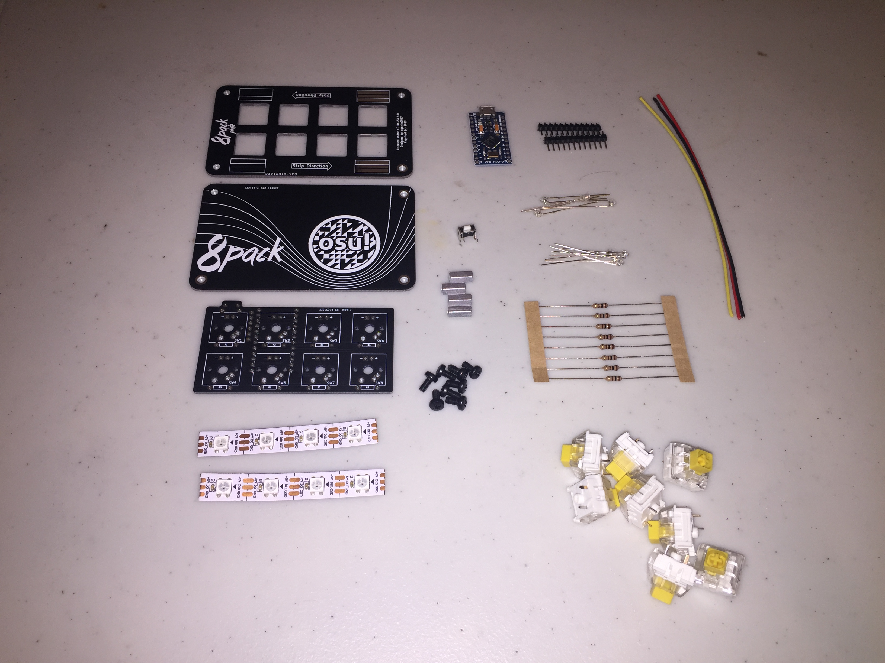

# Step 2 - Assemble top plate

## Step 2.1 - Add the optional underglow lighting - Skip if unneeded

### Step 2.1.1
Peel the cover from the LED strip backside to reveal the adhesive layer

### Step 2.1.2
Align the LED strip pads with the solder pads on the top plate. Make sure that the strip is pointing at the same direction as the top plate, and leave pad space on both ends.

Hint: GND should be aligned along the bold box, and the black line on the strip should align with the midsection of the board.

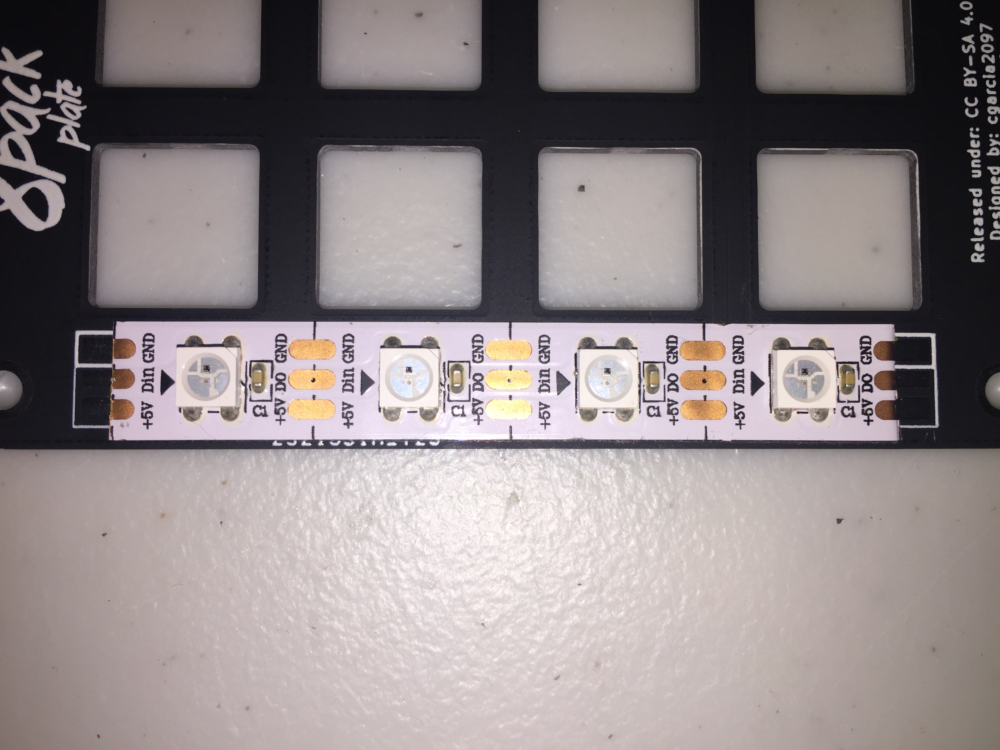

### Step 2.1.3
Bridge the solder pad between the LED strip and the top plate as shown below:

### Step 2.1.4
Repeat for the other side of the strip:

### Step 2.1.5
Now repeat the above steps for the other LED strip:

### Step 2.1.6
Now take the three wires, strip one end for each color, and solder to the pads shown below. The red wire must be soldered to +5V, the yellow to Din, and the black wire to GND.

You may also twist the wire to your heart's content. 

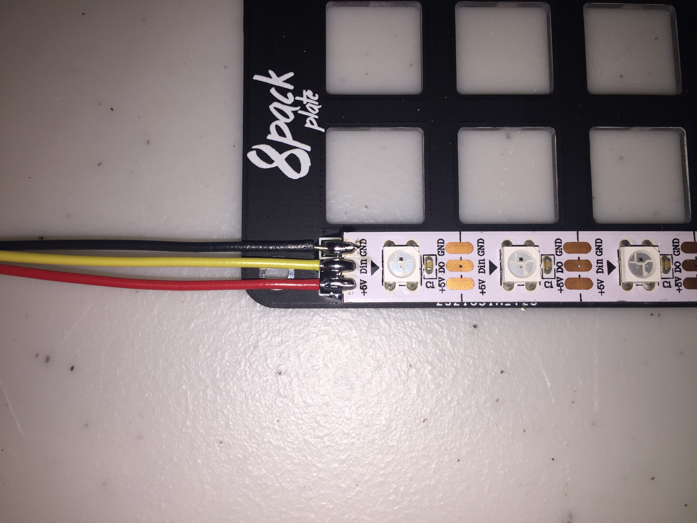

## Step 2.2 - Attach the switches

Attach the switch by pushing it through the square cutouts. Make sure that the switch pins face up and away from you, and that all the switches face in the same direction. An example is shown below:

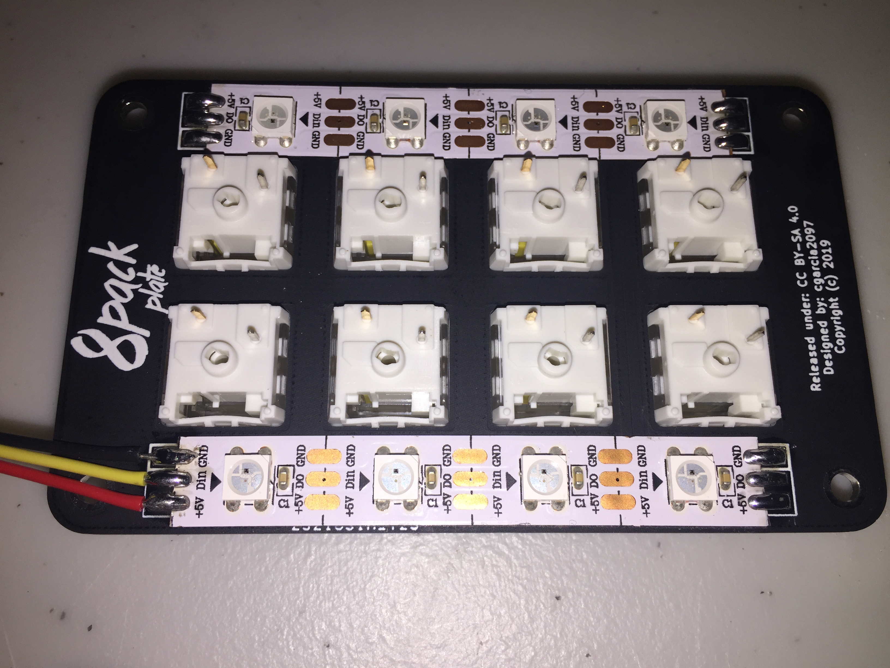

# Step 3 - Assemble the PCB

## Step 3.1 - Attach the resistors to the PCB (For backlighting use, skip if unneeded)

### Step 3.1.1
Bend each resistor to the required shape below:

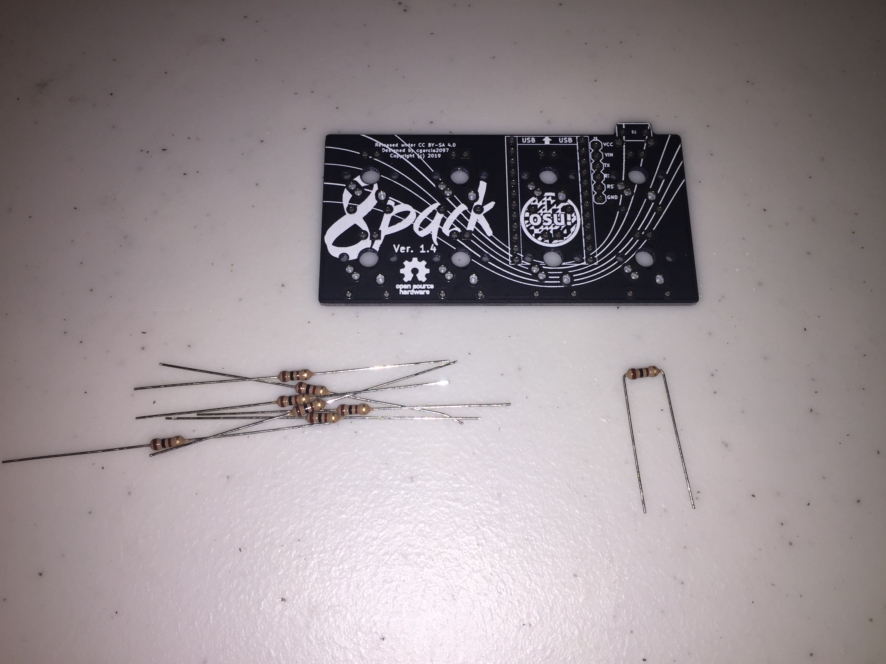

### Step 3.1.2 
Thread each resistor through the markings indicated as `R1` to `R8`. Orientation does not matter here, any direction you plug them into will work.

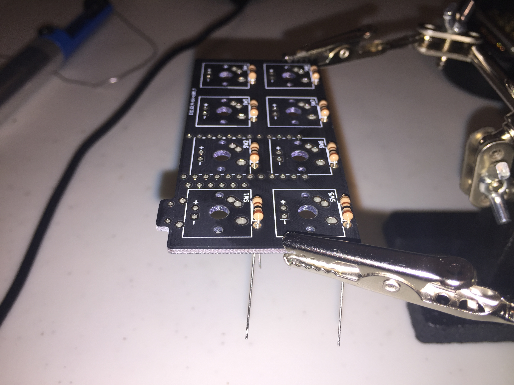

It might be useful to bend the leads outward to prevent the resistors from falling out later

### Step 3.1.3
Solder and trim the resistor leads

## Step 3.2 - Attach headers
This step is rather for me to explain, so I recommend [Sparkfun's guide on how to install headers](https://learn.sparkfun.com/tutorials/arduino-shields/installing-headers-assembly) to get a feel for how this step will work.

Short side goes through the hole and soldered:

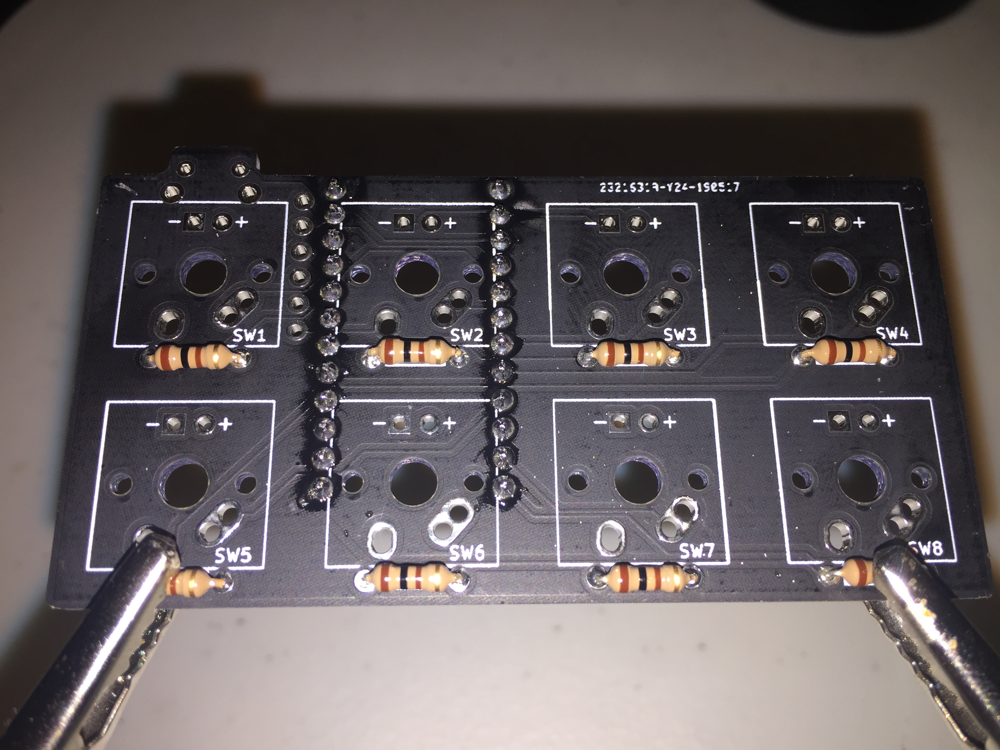

Long side faces away from it:

## Step 3.3 - Attach LEDs (For backlighting use, skip if unneeded)
Depending on your style of switch, the order of assembly will differ.

### Using a BOX-style switch
A BOX switch is characterized by a cross pattern inside a box, as shown here:

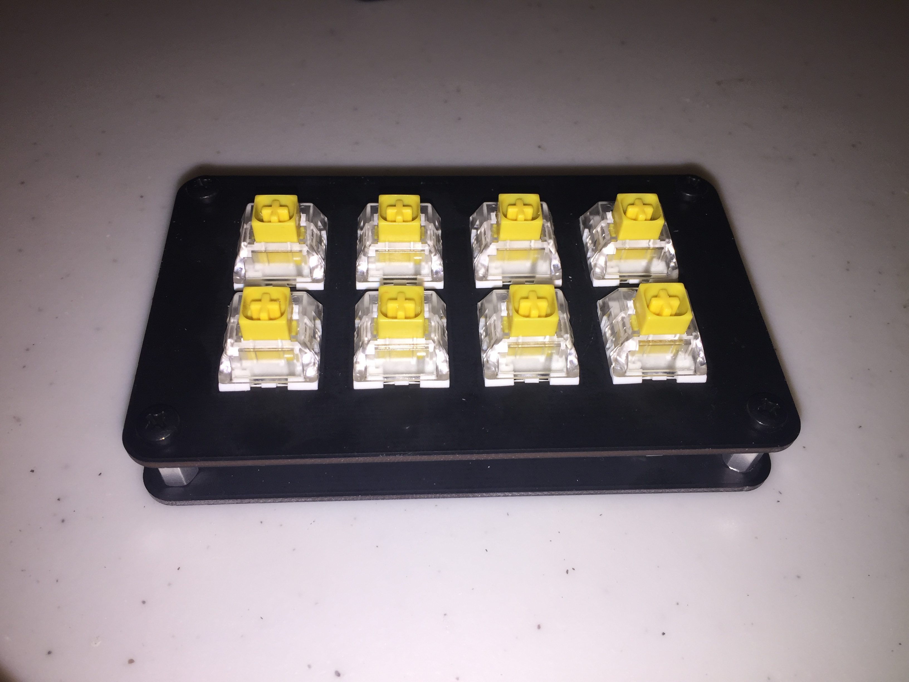

In this case, the LEDs sit underneath the keyswitch. Therefore one must attach the LEDs now.

#### Step 3.3.1
Thread the LEDs through their mounting holes. The orientation matters this time, so make sure the longer lead threads through the circular hole, while the shorter lead threads through the square hole. Sparkfun has guide about LED orientation which you can read [here](https://learn.sparkfun.com/tutorials/light-emitting-diodes-leds/all):

#### Step 3.3.2
Solder the LEDs and trim their leads:

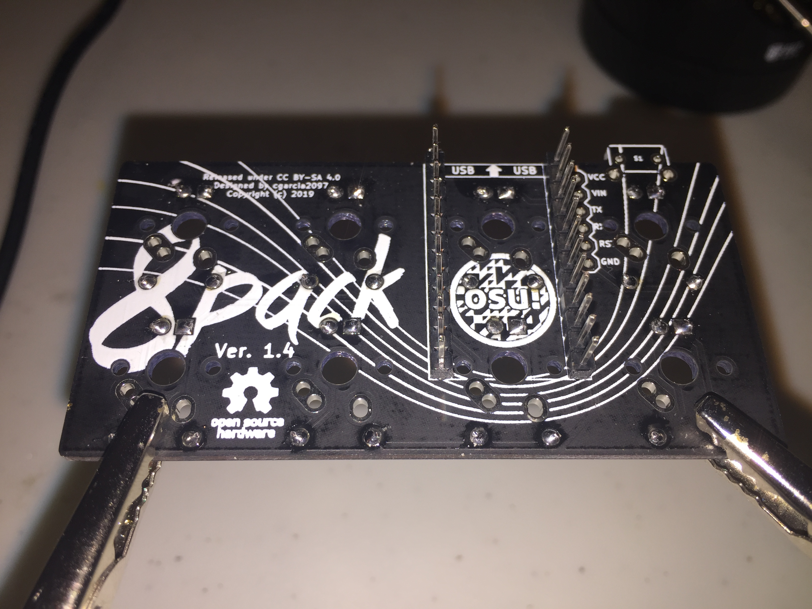

### Using a Cherry-style switch
A Cherry-style switch is characterized by a cross pattern only.

In this case the switch sits on top of the keyswitch. Steps 3.3.1 to 3.3.2 must wait after the top plate has been joined with the PCB.

## Step 3.4 - Attach reset button
### Step 3.4.1
Attach the pushbutton as shown down below:

### Step 3.4.2
Solder the pushbutton to the PCB

# Step 4 - Join top plate and PCB together
## Step 4.1 - Solder the other end of the top plate wire - (For underglow use. skip if unneeded)
### Step 4.1.1
Strip the other end of the wires.

### Step 4.1.2
Attach the wires to their designated locations
* Red to VCC
* Black to GND
* Yellow to RX

### Step 4.1.3
Solder and trim the wires in place:

## Step 4.2 - Attach switches to PCB
Align the switch pins to the PCB holes, press and hold the PCB down and solder the switches in place:

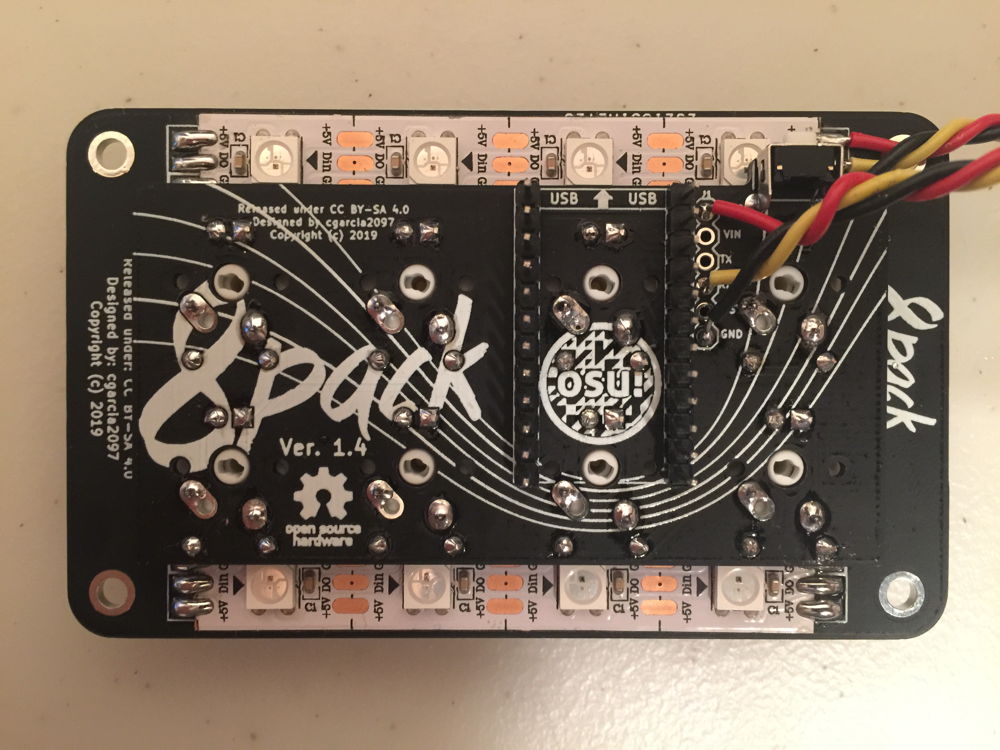

# Step 5 - Attach the microcontroller

## Caution: 

Depending on the revision of the PCB used, the orientation differs. As such, Ver. 1.2 and lower use this orientation (USB port faces away form PCB and south relative to the 8pack logo):

While Ver. 1.3 and above use this orientation (USB port faces towards the PCB and north relative to the 8pack logo):

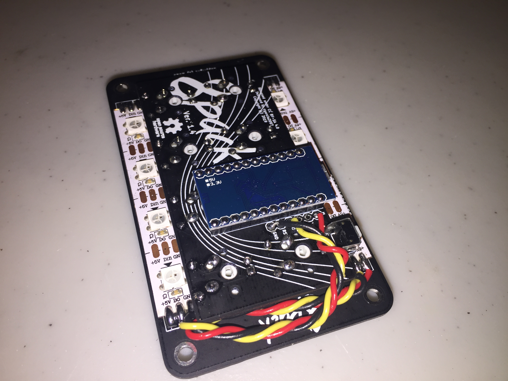

## Step 5.1 
Slot the Pro Micro through the headers

## Step 5.2 
Trim the headers

## Step 5.3
Solder the headers as shown below

# Step 6 - Program the board
Head over to the [Programming section](./PROGRAMMING.md) for this section of the guide.

# Step 7 - Attach the bottom plates
With the included M3 standoffs and bolts, attach the bottom plate to the top plate

Voila, you now have a working keypad, ready for a set of keycaps.
