# Programming Guide for 8pack
This guide will go through the method of flashing default firmware into the 8pack using the Arduino environment. Other methods are under consideration at the moment. 

### 1 - Download the required software

- Download and install the Arduino IDE from the Arduino website. ( [Link](https://www.arduino.cc/en/Main/Software) )
- Click `Install` through all the driver download prompts.
- Click `Close` when finished.

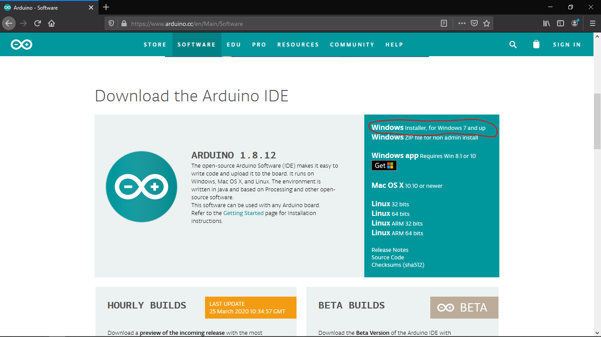

### 2 - Get the code from the repository

- Download and unpack the project: https://github.com/cgarcia2097/8-Pack/archive/master.zip. 
- Inside Arduino, click `File`->`Open`
  
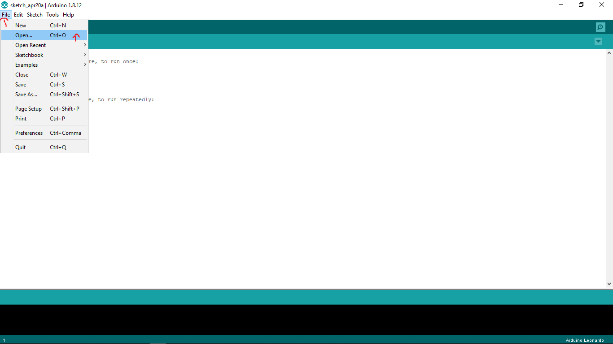

- Find and open the newly-extracted `8-Pack` folder in Arduino
  
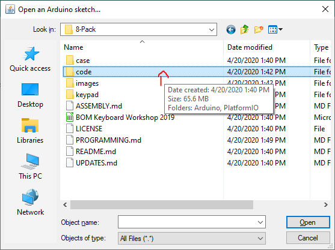

- Inside the folder, go to `code`->`Arduino`->`8pack`->`8pack.ino`.

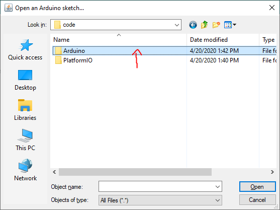
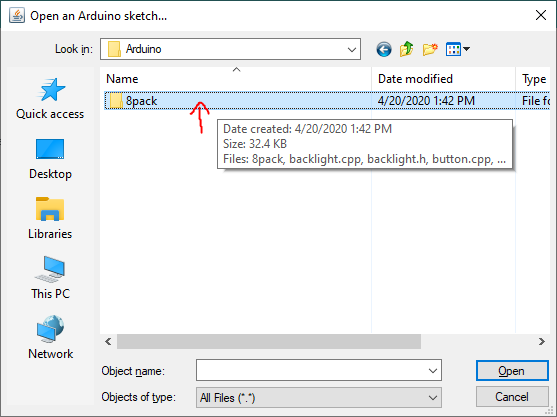

- Open `8pack.ino`

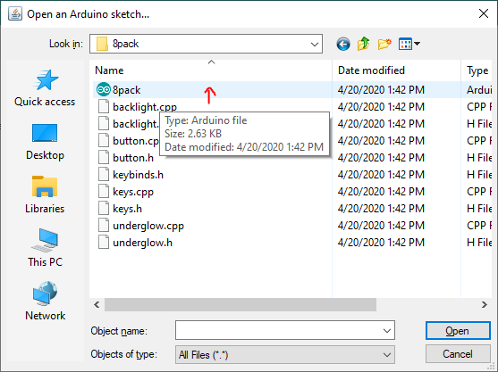

### 3 - Setting up the flashing environment

The 8pack requires a specific environment at the moment to reprogram it, as no app exists at the moment.

#### 3.1 - Installing the Libraries

Once installed, download the required libraries by clicking `Sketch`->`Include Library`->`Manage Libraries` and install these libraries:
  - Adafruit Neopixel
  - Bounce2

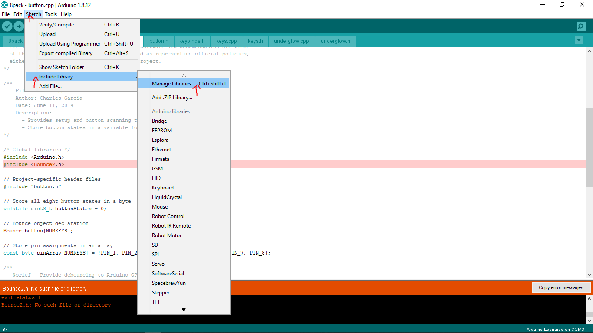
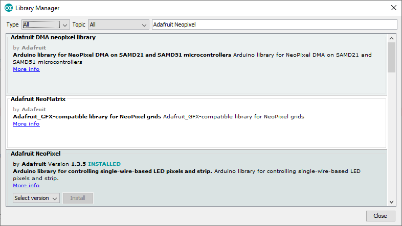

#### 3.2 - Programming for the Pro Micro

To set the environment to program for a Pro Micro, click `Tools`->`Board`->`Arduino Leonardo`. 

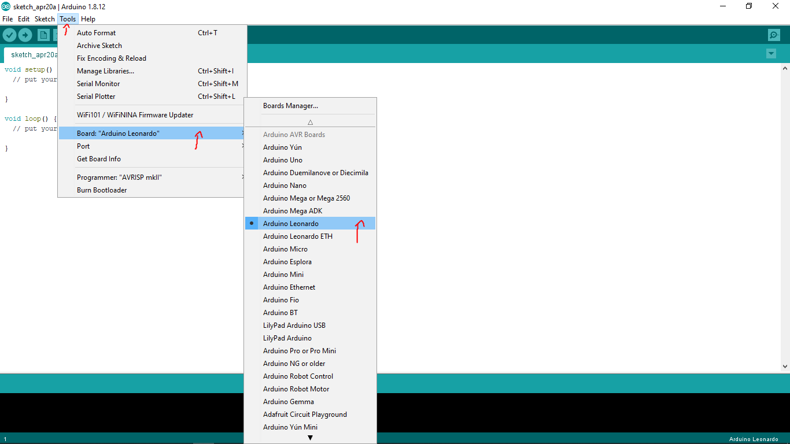

While the Pro Micro has its own [installation guide](https://learn.sparkfun.com/tutorials/pro-micro--fio-v3-hookup-guide/all), it seems to share the same pin labels as the Arduino Leonardo. Choosing the Leonardo allows us to skip the hassle of setting up the Pro Micro manually, but may be subject to change later down the line as Sparkfun may change their design.

### 4 - Editing the keybinds

Click over to the tabs and select `keybinds.h`

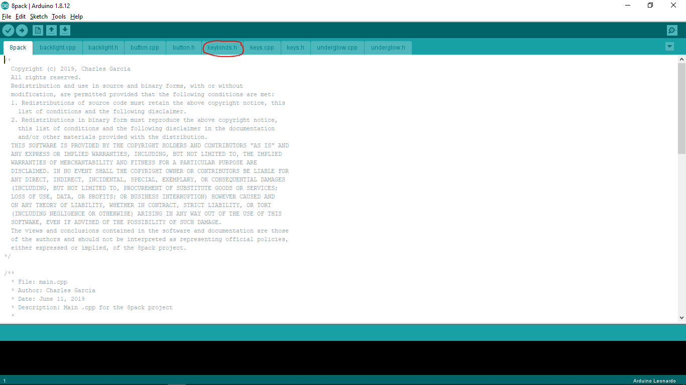

You will see a large block of text that looks like this:
``` 
const unsigned char macroArray[NUMKEYS][HID_USB_LIMIT] = {
  {KEY_ESC, STOP_CODE, STOP_CODE, STOP_CODE, STOP_CODE, STOP_CODE},
  {'d', STOP_CODE, STOP_CODE, STOP_CODE, STOP_CODE, STOP_CODE},
  {'s', STOP_CODE, STOP_CODE, STOP_CODE, STOP_CODE, STOP_CODE},
  {'a', STOP_CODE, STOP_CODE, STOP_CODE, STOP_CODE, STOP_CODE},
  {'v', STOP_CODE, STOP_CODE, STOP_CODE, STOP_CODE, STOP_CODE},
  {'c', STOP_CODE, STOP_CODE, STOP_CODE, STOP_CODE, STOP_CODE},
  {'x', STOP_CODE, STOP_CODE, STOP_CODE, STOP_CODE, STOP_CODE},
  {'z', STOP_CODE, STOP_CODE, STOP_CODE, STOP_CODE, STOP_CODE},
};
```

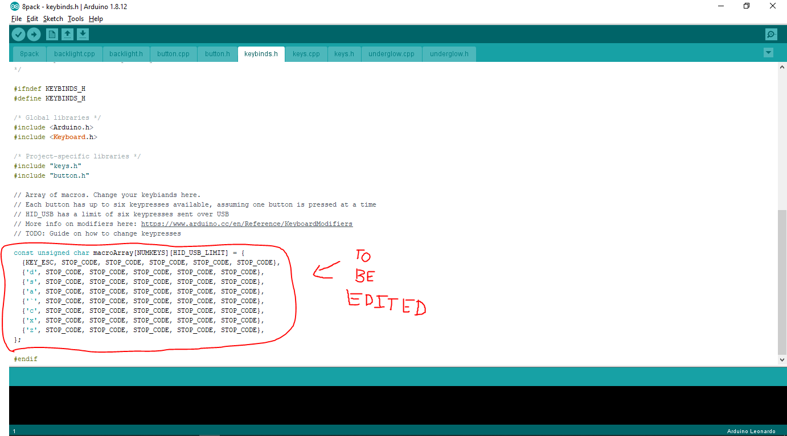


Each row starting from starting underneath `const unsigned char macroArray[]` corresponds to a button on the keypad.

What the keypad does is iterate through each row pressing and releasing (for when button is pressed or released) each key up until the `STOP_CODE` marker appears. This allows us to do a single press or multiple simultaneous keypresses per button.

Let's go through some examples.

- If you want to press the `Escape` key on button 1, the first row should look like:

  `{KEY_ESC, STOP_CODE, STOP_CODE, STOP_CODE, STOP_CODE, STOP_CODE},`

- If you're a little macro heavy and wanna type a six-letter word on button 5, the fifth row should look like:

  `{'m', 'a', 'n', 'n', 'e', 'r'},`

- If you like your Copy and Paste functionalities, your chosen two rows would look like this

  `{KEY_LEFT_CTRL, 'c', STOP_CODE, STOP_CODE, STOP_CODE, STOP_CODE},`

  `{KEY_LEFT_CTRL, 'z', STOP_CODE, STOP_CODE, STOP_CODE, STOP_CODE},`

Letters, numbers and symbols are typed in single quotes, while modifiers like CTRL and SHIFT must use the defined macros here: https://www.arduino.cc/en/Reference/KeyboardModifiers


### 5 - Compiling and uploading the code

- Plug the keypad into your PC.
- Click `Tools`->`Ports` and select the port with (Arduino/Genuino) beside the port name

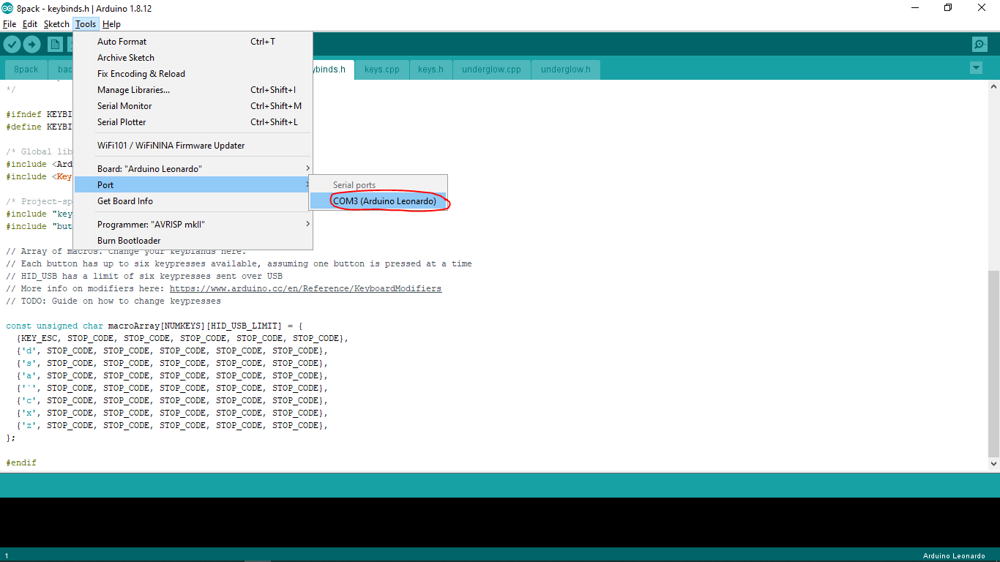
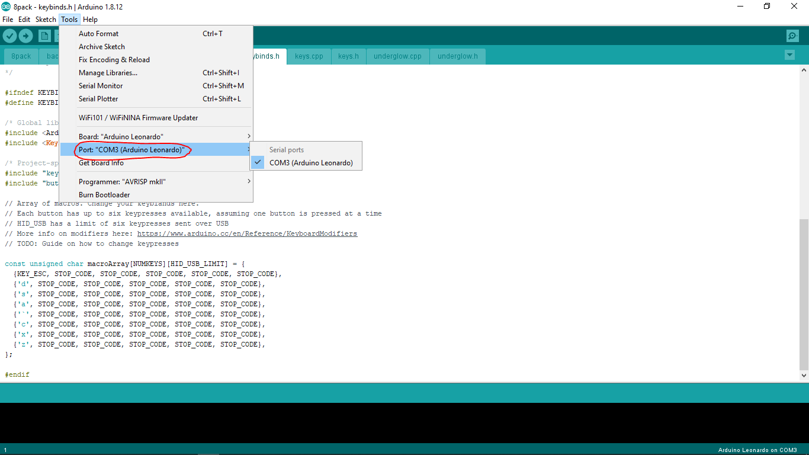


- Click `Verify` to compile your code

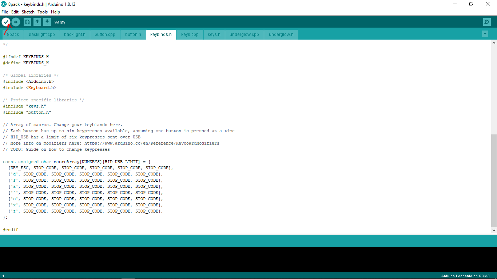


- Click `Upload` to upload your code

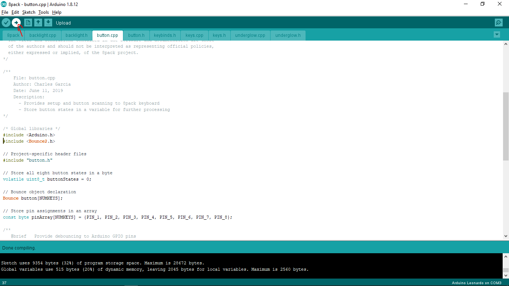


### Testing out the keypad bindings
Open your text editor of choice and give the keys some quick presses and see if the desired keys are being shown on screen. 

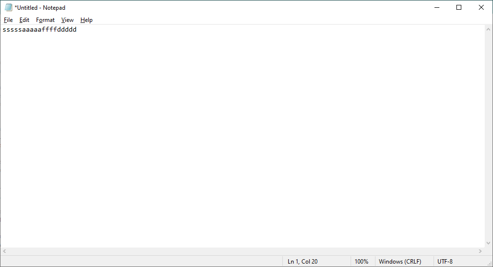

### TMK/QMK support
A third-party has created a QMK port of my keypad, which can be found here: https://github.com/qmk/qmk_firmware/tree/master/keyboards/8pack

