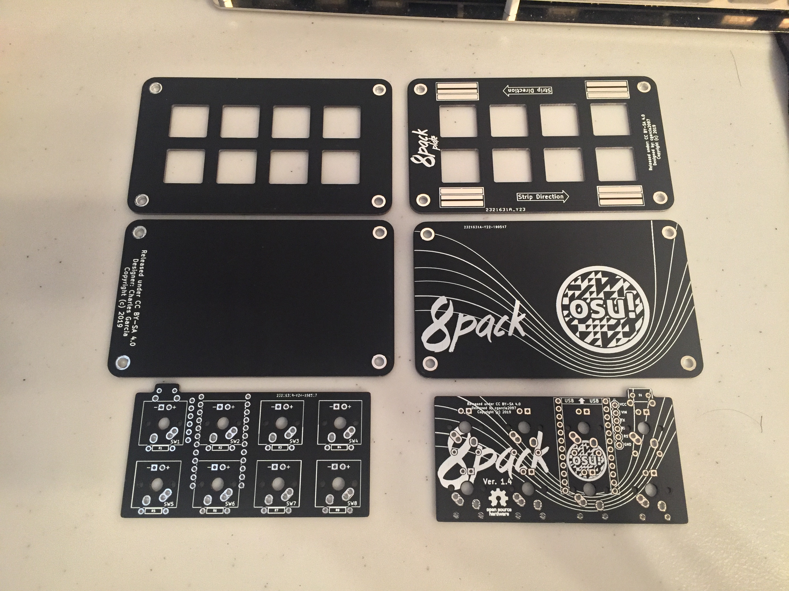
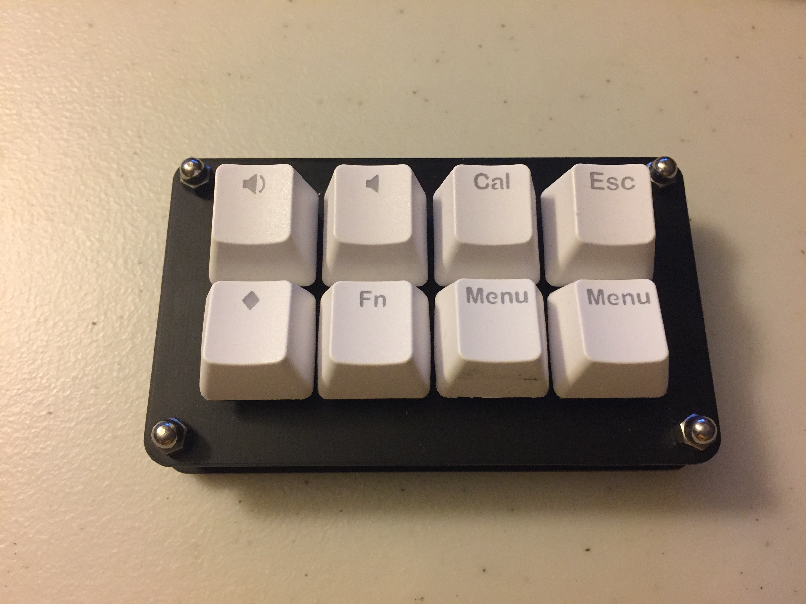
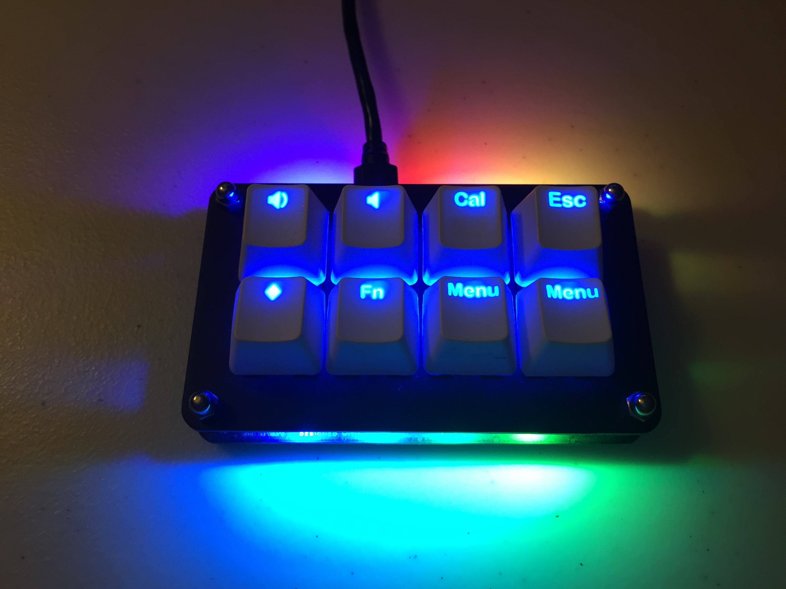

# 8-Pack

Inspired by [di0ib's Six Pack design](http://www.40percent.club/2017/04/six-pack-10.html), this keypad project is intended for me on learning how to use KiCAD by extending their design to 8 keys. Mishaps, snafus and foobars expected and incoming.

## Features

### PCB
  - 8 keys, directly connected to MCU pins
  - 8 backlight LEDs, individually addresssable
  - Alps or MX button support
  - Runs on a simple Arduino sketch, or optionally QMK firmware

### Plates
  - WS2812 strip underglow support, inspired by [di0db's Gherkin ALPS underglow](http://www.40percent.club/2017/08/gherkin-alps-11.html)

## Third-party firmware ports

- Official QMK port, courtesy of [gorbachev](https://github.com/gorbachev)
  - Rev. 1.1 : [Link](https://github.com/qmk/qmk_firmware/tree/master/keyboards/8pack/rev11)
  - Rev. 1.2 : [Link](https://github.com/qmk/qmk_firmware/tree/master/keyboards/8pack/rev12)

## Assembly guides

Assembly guide can be found here: [GUIDE](ASSEMBLY.md)

## Programming guides

Programming guide can be found here: [GUIDE](PROGRAMMING.md)

## Updates

Updates are posted here: [UPDATES](UPDATES.md)
