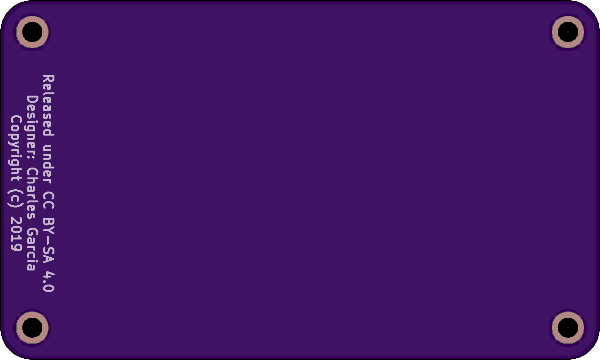
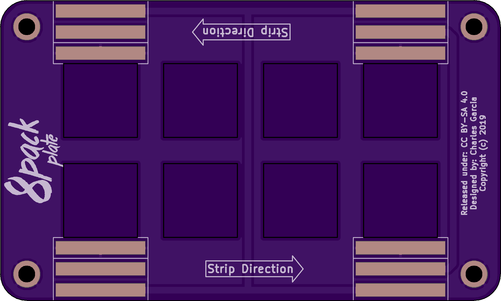
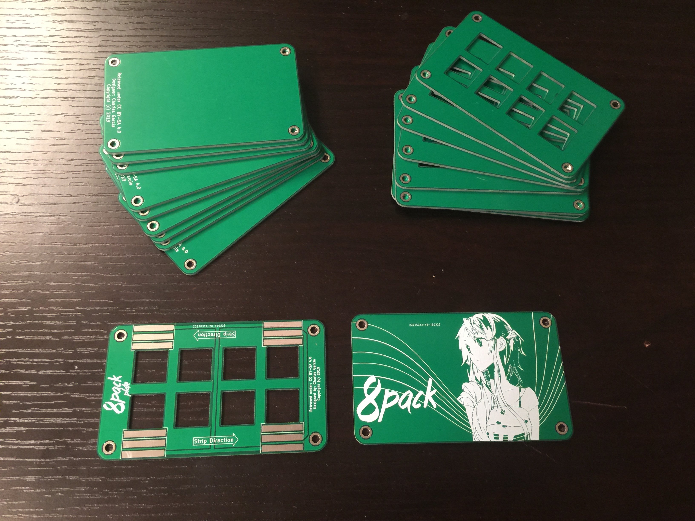
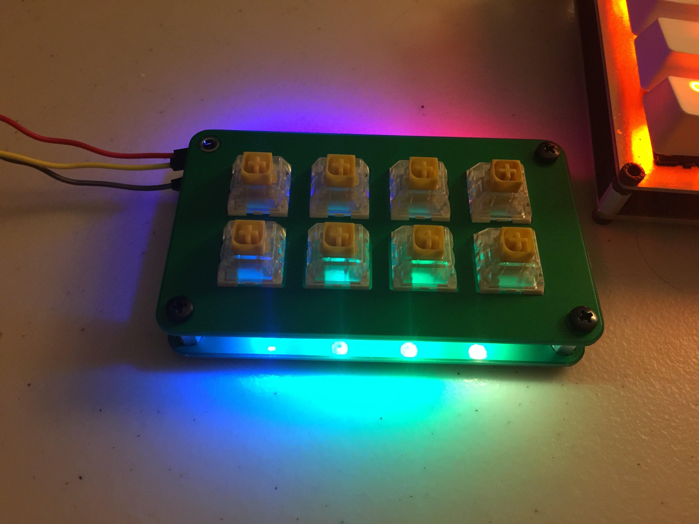

# Update 04/17/2019
I have created a skeleton guide for assembling the 8pack. The order of steps are important since backtracking the steps requires knowledge of desoldering. The guide itself is still a WIP.

Current assembly guide: 

# Update 03/29/2019
Thought I would try doing PCB plates for the keypad. So I whipped up a quick design on KiCAD that integrates LED strips facing downwards from the PCB. 

The plates have arrived from JLCPCB, and the results are as follows:

* The square cutouts are rounded, but still allow for the fitting of Cherry-style switches. I used di0ib's Six-Pack plate as inspiration.

* The LED pads are misaligned with the LED strip I used. Guess I need to re-measure those LED pads once more so they are easier to solder together. In the meantime, I used an old-fashioned solder bridge to do the job. In the end the lighting circuit worked.

* PCB material is tough. No wonder other KBDers use them in budget builds and kits.

### More images in ![/Ver1.1/plates/views] Please enjoy :)

TODO: 
* Assembly guides
* Post photos and format accordingly
* Firmware guides
* Other repo cleanup

# Update 02/20/2018
I decided to take a detour and learn KiCAD for version 1.1 of the PCB. As such, the design files uploaded are now in the KiCAD format. Gerbers, PCB files and schematics are now available for use and scrutiny.

The PCBs have arrived from JLCPCB and tested with a multimeter. Arduino sketch has also been tested on the board to verify basic funtionality.

Fixes:
* RESET and GND are no longer shorted. 
* The Pro Micro has been re-oriented so that the user no longer is required to use sockets to elevate it. Simple male headers will suffice

To-do:
* Assembly/Programming guide
* Upload footage of assembly and programming guide.

## Photos
#### Front

#### Back

# Update 09/27/2018
First batch of PCBs have arrived from Aisler. I am happy to report that the PCBs are of high quality, as well as my footprints being correct and accurate. The parts fit together like a charm. 

Unfortunately, the existing gerbers on the repo exhibit issues discussed below:

- RESET and GND are shorted for some reason. Verified with a continuity check for the entire batch. Must be my fault since they are short for all three. Just don't connect anything to the RST header on the Pro Micro, and it should work.

- The USB port on the Pro Micro touches switch #7's contacts, and interferes with the operation. Current workaround is to use a machine socket to hold the Pro Micro in place. See di0ib's use of sockets here: http://www.40percent.club/2017/04/six-pack-10.html

Otherwise I am happy to report that the keyboard is mostly functional and ready to rock some Arduino code. Will be posting footage on my youtube channel when time permits.

# Some info
- Key Unit Size: 19 mm 

###### Board

###### Schematic

If using swillkb's plate editor don't forget to set the unit size to 19 mm. Otherwise, the centers of each switch are 19 mm apart

# Photos
###### Lighting

###### Pro Micro Attached

###### Back Side

###### Front Side

